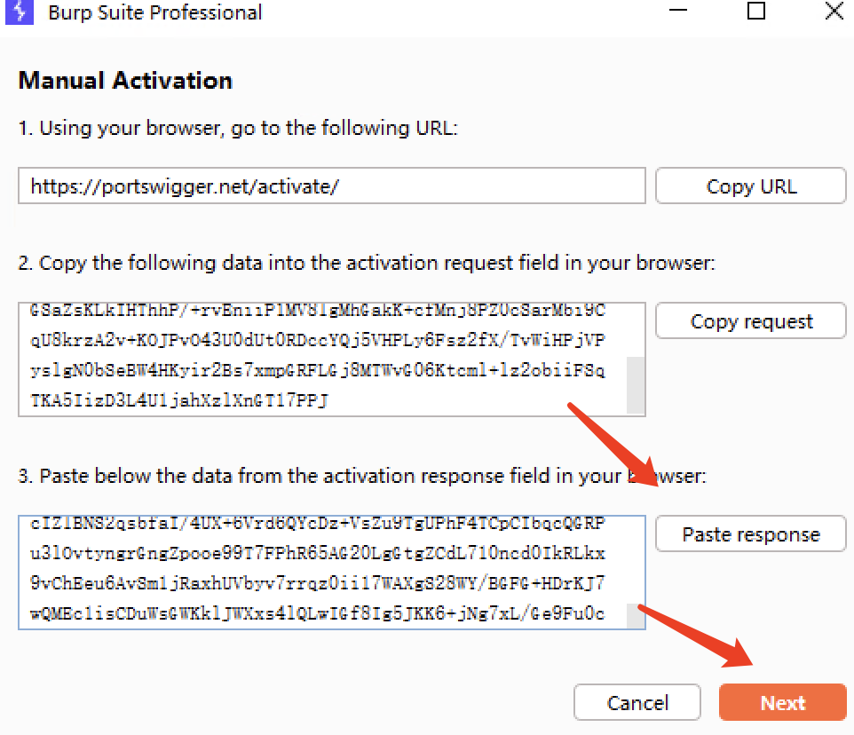

## tutorial

1. 将 `BurpLoaderKeygen_v1.17.jar` 或者 `loader.jar` ， `New-loader.jar` 添加到与 `burpsuite_pro.jar` 同一个目录。

2. 在`BurpsuitePro.vmoptions`中添加如下内容，注意破解jar的名字

   ```
   --add-opens=java.base/java.lang=ALL-UNNAMED
   --add-opens=java.base/jdk.internal.org.objectweb.asm=ALL-UNNAMED
   --add-opens=java.base/jdk.internal.org.objectweb.asm.tree=ALL-UNNAMED
   --add-opens=java.base/jdk.internal.org.objectweb.asm.Opcodes=ALL-UNNAMED
   -javaagent:BurpLoaderKeygen_v1.17.jar
   -noverify
   ```

3. 运行如下命令

   ```bash
   java -jar /path/to/BurpLoaderKeygen_v1.17.jar
   ```

   

   复制license到如下

   

   点击 Manual antivation

   

   

   

   

4. ***Enjoy!!!***

## Repos

[1](https://github.com/xiv3r/Burpsuite-Professional), [2](https://github.com/SNGWN/Burp-Suite-Pro), [origin](https://github.com/h3110w0r1d-y/BurpLoaderKeygen)

> [!WARNING]
>
> 本仓库用于学习交流，请勿用于商业用途

